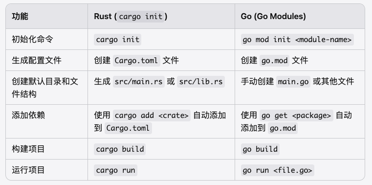
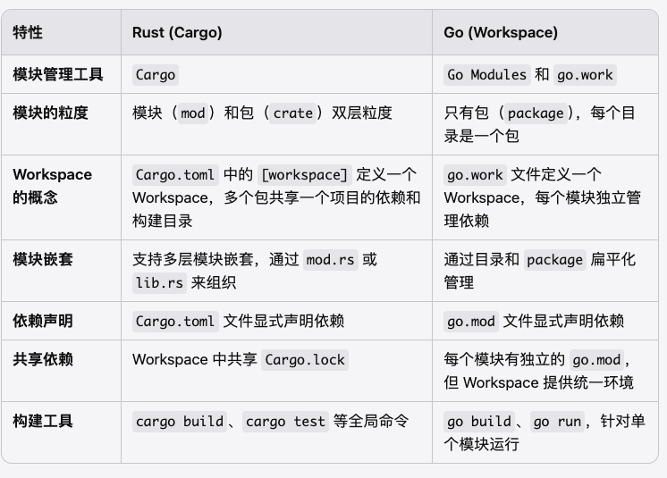
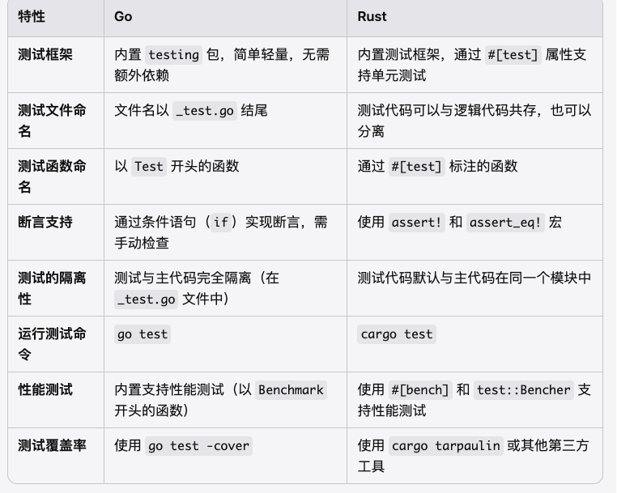

# Go VS Rust

通过对比 Go 和 Rust 的语法，来学习 Go 语言

## 创建模块


如果你熟悉 Rust 的 cargo 工具，可以将 Go 的初始化流程理解为以下步骤：

cargo init → mkdir <project> && cd <project> && go mod init <module-name>
创建 main.rs → 创建 main.go
cargo run → go run main.go
cargo add → go get
cargo build → go build
cargo test → go test

## 多模块管理

项目结构

```
~/Desktop/go-crypto tree -L 2 --gitignore
.
├── eth
│   └── go.mod
├── go.mod
├── go.work
├── images
│   └── go-mod-init.png
├── main.go
├── README.md
├── shared_lib
│   ├── go.mod
│   └── utils.go
└── sol
    └── go.mod
```

对比


## 单元测试

go 的单元测试时内置的，且有一定的工程约定，比较简单。


